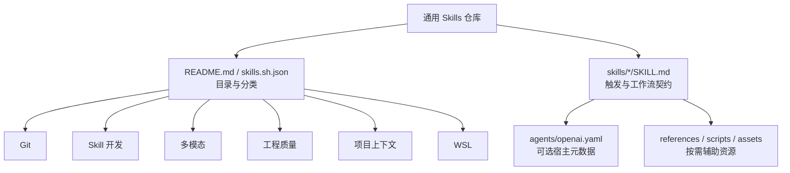

# 项目 AI 上下文索引

## 项目概览

这是一个面向 Claude Code、Codex 和 OpenCode 的通用 Agent Skills 仓库。每个 `skills/<name>/` 目录都是可独立安装的技能单元；根目录负责技能目录、分类、安装说明和共享维护约定，不承载业务运行时。

## 仓库结构

```text
.
├── .agents/skills/            # skills 工具生成的本地安装镜像
├── .claude/skills/            # 指向 .agents/skills 的 Claude 兼容软链接
├── README.md                 # 技能目录、来源与安装说明
├── skills.sh.json            # skills.sh 分类与展示元数据
├── skills-lock.json           # 本地安装来源与内容哈希
├── requirements.txt          # 维护/校验工具所需的 Python 依赖
├── tasks/lessons.md           # 可复用的项目维护教训
└── skills/
    └── <skill>/
        ├── SKILL.md           # 必需：触发描述与完整工作流
        ├── agents/openai.yaml # 可选：Codex 展示或调用策略
        ├── references/        # 可选：按需加载的详细规则
        ├── scripts/           # 可选：技能自带的可执行辅助工具
        └── assets/            # 可选：报告或界面资源
```

`.agents/`、`.claude/` 和 `skills-lock.json` 是安装/同步状态，不是通用 Skill 的事实来源；同名技能应以 `skills/` 下的源码为准。

## 架构关系



## Skill 索引

| 分类 | Skill | 职责 | 入口与辅助资源 |
|---|---|---|---|
| Git | `git-commit` | 分析变更并生成 Conventional Commit，提交前要求确认 | [SKILL.md](skills/git-commit/SKILL.md) |
| Git | `commit-zh` | 由主 Agent 执行中文 Conventional Commit，不自动推送 | [SKILL.md](skills/commit-zh/SKILL.md) |
| Skill 开发 | `update-skill` | 创建或更新通用 Skill 的结构、描述、指令和资源 | [SKILL.md](skills/update-skill/SKILL.md)、`references/best-practices.md`、`agents/openai.yaml` |
| Skill 开发 | `optimize-agent-instructions` | 依据行为证据优化指令负担、触发与加载方式，保持用途和交付契约 | [SKILL.md](skills/optimize-agent-instructions/SKILL.md) |
| Skill 开发 | `skill-doctor` | 从真实本地 Agent 会话评估技能效率与代码质量并生成报告 | [SKILL.md](skills/skill-doctor/SKILL.md)、`scripts/`、`scorers/`、`references/`、`assets/` |
| 多模态 | `image-analyzer` | 按任务范围直读图片或通过视觉代理分析，完整分析与交接保留五节描述 | [SKILL.md](skills/image-analyzer/SKILL.md) |
| 多模态 | `show-me` | 用 Mermaid、代码结构草图或聚焦 HTML 图解主题 | [SKILL.md](skills/show-me/SKILL.md)、`agents/openai.yaml` |
| 工程质量 | `code-review` | 只读审查未提交或指定基线后的变更，分别核对仓库规范与需求 | [SKILL.md](skills/code-review/SKILL.md)、`agents/openai.yaml` |
| 工程质量 | `simplify` | 保持行为不变地简化代码，改善可读性，默认聚焦近期改动 | [SKILL.md](skills/simplify/SKILL.md) |
| 工程质量 | `review-fix-goal` | 显式触发后审查、修复、验证至问题清零，复用有效证据并经确认提交/推送 | [SKILL.md](skills/review-fix-goal/SKILL.md)、`agents/openai.yaml`、`references/commit.md`、`references/review.md` |
| 工程质量 | `scoped-change` | 界定请求的正确变更边界，避免遗漏或范围扩张 | [SKILL.md](skills/scoped-change/SKILL.md) |
| 项目上下文 | `index-project` | 创建项目与模块索引，代码变更影响索引时主动同步；以单份状态快照保留续扫断点 | [SKILL.md](skills/index-project/SKILL.md)、`references/first-index.md`、`references/incremental-index.md` |
| 项目上下文 | `writing-for-agents` | 为 Agent 编写低上下文负担、触发清晰且过程稳定的指令文档 | [SKILL.md](skills/writing-for-agents/SKILL.md)、`references/skill-mechanics.md`、`agents/openai.yaml` |
| 项目上下文 | `unslop` | 清理文本中的 AI 套话与机械结构，同时保留原意和语气 | [SKILL.md](skills/unslop/SKILL.md)、`agents/openai.yaml` |
| 项目上下文 | `ux-writing` | 编写或审查用户可见文案、文档、帮助和诊断文本 | [SKILL.md](skills/ux-writing/SKILL.md) |
| WSL | `wsl-windows-image` | 将 Windows 图片路径转换为 WSL 路径后读取图片 | [SKILL.md](skills/wsl-windows-image/SKILL.md) |

## 安装与验证

- 安装全部技能：`npx skills add liao666brant/skills -g`
- 安装单个技能：`npx skills add liao666brant/skills --skill <skill-name> -g`
- 校验目录 JSON：`jq empty skills.sh.json`
- 检查补丁空白问题：`git diff --check`
- 运行 `skill-doctor` 的现有单元测试：`uv run python -B -m unittest discover -s skills/skill-doctor/scripts -p 'test_*.py'`

仓库没有统一构建步骤。`requirements.txt` 当前仅声明 `PyYAML`，用于基于 Python 的 Skill 元数据读取或校验；不要为了纯文档修改安装额外依赖或执行全仓构建。

## 维护约定

- `SKILL.md` frontmatter 至少保留 `name` 和准确、可触发的 `description`；正文写必要步骤，详细分支下沉到 `references/`。精简时保留原用途、自动触发、输入输出与副作用边界，功能和政策变更以用户明确要求为准。
- 通用 Skill 源码保持 agent-neutral；宿主专用展示信息放在可选的 `agents/openai.yaml`，不要在源码中硬编码个人安装目录。
- 新增、删除、重命名或重新分类 Skill 时，同步更新 `README.md` 和 `skills.sh.json`。
- 仅在技能确有可执行逻辑时增加 `scripts/` 和针对性测试；不要为文档型 Skill 创建空脚手架。
- 第三方来源与许可说明集中维护在根 `README.md`；当前各 Skill 目录不重复放置许可证文件。
- 不编辑 vendored 或生成内容来实现业务逻辑；`skill-doctor/assets/pierre-diffs.js` 是随报告使用的大型前端资源。
- 提交默认保持原子且不自动推送；只暂存本目标路径，并保留用户已有的暂存、未暂存和未跟踪内容。

## AI 修改指引

1. 先读取目标 Skill 的完整 `SKILL.md`，再按其引用关系读取必要资源。
2. 修改触发条件时同时核对 `description`、正文适用范围和 `agents/openai.yaml`，避免入口描述彼此矛盾。
3. 优先替换或收敛既有指令，避免重复规则、推测性兼容层和无使用场景的抽象。
4. 验证应与改动范围匹配：文档改动检查结构、链接、frontmatter 和 diff；脚本改动运行对应测试。
5. `.agents/`、`.claude/` 与 `skills-lock.json` 属于安装状态，不要直接修改镜像；仅在任务明确包含安装结果时从 `skills/` 源码重新同步。

## 索引状态

- 上次索引：2026-09-13T04:54:18Z
- 基线提交：ef8f86dc463ff47096059e460994a9486bec81b1
- 索引范围：根级；按用户约定不创建 Skill 目录级 `AGENTS.md` 与 `CLAUDE.md`
- 已知缺口：无
- 扫描进度：已完成
